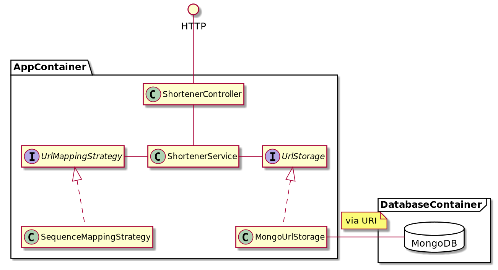

# Url Shortener

Just a basic toy implementation of an url shortener web service based on Spring Boot, MongoDB - containerized/orchestrated with Docker Compose.

## System overview



## How to run

### Prerequisites

*Only tested on Linux so far*

* Docker
* Docker Compose
* Make

```
git clone git@github.com:bw0248/url-shortener.git
cd coding-challenge-bw0248
cp env.example .env
```

### Run as local docker deployment

After starting via docker the app is running on port 8081.

```
# run tests
make test

# run app and db in background (or just make to run in foreground)
make daemon

# verify app and db are running
docker ps | grep bw0248

# stop server and db
make stop

# to remove persisted data permanently
docker volume rm url-shortener-data
docker volume rm url-shortener-test-data
```

### Run from IDE

Make sure db (or testdb for tests) is up and running before launching via IDE

```
# start db
make db

# start testdb for running automated tests from IDE
make testdb
```

After starting from IDE the app is running on port 8080.

## Insomnina Workspace

You can import `insomnia-requests.json` into Insomnia (and possibly into postman as well).
The workspace contains two envs - one vs docker deployed app and one vs dev/IDE

## Swagger Docs

* [Swagger Docs for docker deployment](http://localhost:8081/swagger-ui/index.html)
* [Swagger Docs when running from IDE](http://localhost:8080/swagger-ui/index.html)

## Things still missing

* Monitoring/Metrics of app state
* Reporting for critical errors
* Exceptions and error protocol for FE dev
* Some sort of access control
* More automated testing
* Better caching scheme instead of simple Spring cache